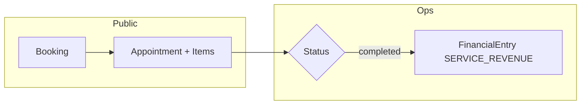
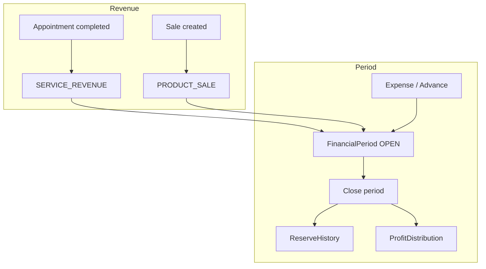

# Barber SaaS Platform

**AI-ready barber shop operations platform** with public booking, role-based dashboard, dynamic scheduling, financial management, inventory, and sales — built as a modern refactor from a legacy Django stack.

[](https://fastapi.tiangolo.com/)
[](https://nextjs.org/)
[](https://www.postgresql.org/)
[](https://www.typescriptlang.org/)
[](https://www.docker.com/)
[](LICENSE)

> **Português:** see [README.pt-BR.md](./README.pt-BR.md)

---

## Overview

This is **not** a generic barbershop CRUD demo. It is an **operational SaaS foundation** designed for:

- **Public self-service booking** (no account required)
- **Internal operations** (`admin` + `barber` roles)
- **Interval-based scheduling** (not fixed slots)
- **Multi-service appointments** (session model)
- **Financial management** (periods, cash reserve, professional participation)
- **Inventory and sales** integrated with finance
- **Future AI layer** (WhatsApp agent, automation) without coupling business logic to the UI

| Layer | Status |
|-------|--------|
| Core API + PostgreSQL + migrations (001–014) | ✅ Implemented |
| JWT auth + RBAC | ✅ Implemented |
| Public booking + “My appointments” | ✅ Implemented |
| Scheduling (`AppointmentItem`, availability, blocks) | ✅ Implemented |
| Appointment completion → automatic revenue | ✅ Implemented |
| Financial module (periods, expenses, advances, close) | ✅ Implemented |
| Inventory, sales, product categories | ✅ Implemented |
| AI agents / WhatsApp | 📋 Planned |

**Version:** API `0.2.0` · **Active development**

---

## Preview

Screenshots will be added before the public GitHub release.

| Surface | Route | Description |
|---------|-------|-------------|
| **Public home** | `/` | Landing, services, professionals, WhatsApp CTA |
| **Booking** | `/booking` | Service(s) → professional → date → time → confirm |
| **My appointments** | `/my-appointments` | Phone lookup, cancel / reschedule |
| **Dashboard** | `/dashboard` | Operational overview (today, low stock, KPIs) |
| **Appointments** | `/dashboard/appointments` | Manage sessions and status |
| **Calendar** | `/dashboard/calendar` | Calendar view |
| **Financial / Wallet** | `/dashboard/financial` | Admin: financial panel · Barber: personal wallet |
| **Inventory** | `/dashboard/inventory` | Products, movements, sales, categories |
| **Services** | `/dashboard/services` | Service CRUD (admin) |
| **Professionals** | `/dashboard/professionals` | CRUD, participation %, availability (admin) |
| **Settings → Profile** | `/dashboard/settings/profile` | Professional public profile |

```text
┌──────────────────────────────────────────────────────────────────────────┐
│  [ Home ]     [ Booking ]     [ My appointments ]                         │
└──────────────────────────────────────────────────────────────────────────┘
                                    │
                                    ▼
┌──────────────────────────────────────────────────────────────────────────┐
│  FastAPI (/api/v1)  ◄──►  PostgreSQL  │  Redis (infra ready)           │
└──────────────────────────────────────────────────────────────────────────┘
                                    │
          ┌─────────────────────────┼─────────────────────────┐
          ▼                         ▼                         ▼
    Appointments              Financial                 Inventory / Sales
    (session + items)     (periods, audit)           (products, categories)
```

---

## Features

### Public experience

| Feature | Status |
|---------|--------|
| Public landing page | ✅ |
| Service catalog | ✅ |
| Professionals showcase (visibility-controlled) | ✅ |
| Step-by-step booking flow | ✅ |
| Multi-service booking (`service_ids`) | ✅ |
| Available slots API (15 min granularity) | ✅ |
| “My appointments” by phone | ✅ |
| WhatsApp deep link CTA | ✅ (manual; WAHA planned) |

### Operational dashboard

| Feature | Status |
|---------|--------|
| JWT login (access + refresh) | ✅ |
| Admin seed on first startup | ✅ |
| Role-based navigation | ✅ |
| Services CRUD | ✅ |
| Professionals onboarding + participation % (100% validation) | ✅ |
| Professional profile + User linking | ✅ |
| Appointments (status, completion, cancel, reschedule) | ✅ |
| Completion → `FinancialEntry(SERVICE_REVENUE)` | ✅ |
| Calendar / operational agenda | ✅ |
| `ProfessionalAvailability` + management UI | ✅ |
| `ProfessionalScheduleBlock` | ✅ |
| Financial module (dashboard, expenses, advances, period close) | ✅ |
| Professional wallet (`/financial/my-wallet`) | ✅ |
| Inventory, movements, sales, categories | ✅ |

### Financial

| Feature | Status |
|---------|--------|
| Open/closed `FinancialPeriod` | ✅ |
| `FinancialEntry` with `amount_snapshot` | ✅ |
| Auto revenue on appointment completion | ✅ |
| Auto revenue on product sale (`PRODUCT_SALE`) | ✅ |
| Operational `Expense` | ✅ |
| Professional `Advance` (vale) | ✅ |
| Configurable cash `reserve_percentage` | ✅ |
| `ReserveHistory` | ✅ |
| `ProfitDistribution` by participation | ✅ |
| Period close with totals snapshot | ✅ |
| `FinancialAuditLog` | ✅ |

### Inventory & sales

| Feature | Status |
|---------|--------|
| Product CRUD + minimum stock | ✅ |
| Movements `IN` / `OUT` / `ADJUSTMENT` | ✅ |
| Negative stock blocked | ✅ |
| Movement history | ✅ |
| Operational sale with auto stock deduction | ✅ |
| Sale cancellation with restock + financial reversal | ✅ |
| Product categories (CRUD, soft delete, filter) | ✅ |
| Block delete when products linked | ✅ |
| Category aggregations (analytics-ready) | ✅ |

### AI-ready architecture

| Capability | Status |
|------------|--------|
| Stateless API for agents | ✅ |
| Clear domain boundaries | ✅ |
| Public phone-scoped endpoints | ✅ |
| LangGraph operational agent | 📋 Planned |
| WAHA WhatsApp integration | 📋 Planned |
| Automated reminders / rescheduling | 📋 Planned |

---

## Tech stack

### Backend

- **FastAPI** — async REST, OpenAPI
- **SQLAlchemy 2** — async ORM (`postgresql.ENUM` with `values_callable` for domain enums)
- **PostgreSQL 16**
- **Redis 7** — connected at startup
- **Alembic** — migrations **001–014**

### Frontend

- **Next.js** (App Router) · **React** · **TypeScript**
- **TanStack React Query** · **Tailwind** + **shadcn/ui**
- **React Hook Form** + **Zod**

### Infrastructure

- **Docker Compose** — `postgres`, `redis`, `api`, `web`

### Future AI layer

- **LangGraph** · **OpenAI** · **WAHA**

---

## Architecture

### Two flows, one domain

```text
                    PUBLIC FLOW                         OPERATIONAL FLOW
                          │                                    │
    Guest ──► Landing / Booking / My Appointments      Staff ──► Dashboard (JWT)
                          │                                    │
                          └──────────────┬─────────────────────┘
                                         ▼
                              FastAPI (/api/v1)
                                         │
        ┌────────────────────────────────┼────────────────────────────────┐
        ▼                                ▼                                ▼
   Appointments                     Financial                      Inventory / Sales
        │                                │                                │
        └────────────────────────────────┴────────────────────────────────┘
                                         ▼
                                   PostgreSQL
```

### RBAC

| Entity | Role |
|--------|------|
| **User** (`admin` / `barber`) | Authentication |
| **Professional** | Public profile, services, availability, calendar, participation % |
| **Guest** | Booking and lookup by phone (no User) |

- **Admin:** full control including finance close and inventory.
- **Barber:** own calendar, profile, and wallet; restricted global CRUD.

### System domains

| Domain | Responsibility | Main entities |
|--------|----------------|---------------|
| **Identity** | JWT, roles | `User` |
| **Catalog** | Services | `Service`, `professional_services` |
| **Professionals** | Profile, availability, participation | `Professional`, `ProfessionalAvailability`, `ProfessionalScheduleBlock` |
| **Scheduling** | Sessions and slots | `Appointment`, `AppointmentItem` |
| **Financial** | Periods, revenue, expenses, reserve, distribution | `FinancialPeriod`, `FinancialEntry`, `Expense`, `Advance`, `ProfitDistribution`, `FinancialSettings`, `ReserveHistory` |
| **Inventory** | Products and movements | `Product`, `ProductCategory`, `InventoryMovement` |
| **Sales** | Product sales | `Sale`, `SaleItem` |
| **Audit** | Sensitive event trail | `FinancialAuditLog` |

### Core models

#### Scheduling

| Model | Notes |
|-------|-------|
| **Appointment** | Session: client, professional, date/time, totals, `status` |
| **AppointmentItem** | Service in session: duration, price, order |
| **ProfessionalAvailability** | Weekly rule |
| **ProfessionalScheduleBlock** | Point-in-time block |

Statuses: `scheduled`, `confirmed`, `completed`, `cancelled`, `no_show`.

#### Financial

| Model | Notes |
|-------|-------|
| **FinancialPeriod** | `OPEN` / `CLOSED`, snapshot totals on close |
| **FinancialEntry** | `SERVICE_REVENUE`, `PRODUCT_SALE`, `MANUAL_REVENUE`; `amount_snapshot` |
| **Expense** · **Advance** · **ProfitDistribution** | Period-scoped operations |
| **FinancialSettings** | `reserve_percentage` |
| **ReserveHistory** | Reserve movements |
| **FinancialAuditLog** | `action`, `entity_type`, `metadata` (JSONB) |

#### Inventory & sales

| Model | Notes |
|-------|-------|
| **ProductCategory** | Soft delete via `is_active` |
| **Product** | `category_id`, stock, minimum |
| **InventoryMovement** | `IN`, `OUT`, `ADJUSTMENT` |
| **Sale** / **SaleItem** | `COMPLETED` / `CANCELLED` |

### Scheduling engine

> **An appointment is a session.** Services are **appointment items**.

**Slot algorithm:** sum durations → filter professionals (M2M) → weekly availability → subtract blocks and overlapping appointments → 15-minute step.

### Operational flow



### Financial flow



- Participation percentages for active professionals must sum to **100%** at period close.
- Cash reserve is retained before profit distribution.

### Inventory flow

Stock changes via `InventoryMovement`; negative stock is blocked; low-stock alerts on dashboard.

### Sales flow

Sale creates `OUT` movements + `FinancialEntry(PRODUCT_SALE)`; cancellation restocks and reverses finance + audit events.

### Financial audit events

`EXPENSE_CREATED`, `ADVANCE_CREATED`, `SETTINGS_UPDATED`, `RESERVE_UPDATED`, `PERIOD_CLOSED`, `PRODUCT_CREATED`, `PRODUCT_UPDATED`, `STOCK_UPDATED`, `SALE_CREATED`, `SALE_CANCELLED`, `CATEGORY_CREATED`, `CATEGORY_UPDATED`, `CATEGORY_DEACTIVATED`.

Entity types: `EXPENSE`, `ADVANCE`, `FINANCIAL_SETTINGS`, `FINANCIAL_PERIOD`, `RESERVE_HISTORY`, `PRODUCT`, `SALE`, `INVENTORY_MOVEMENT`, `PRODUCT_CATEGORY`.

### Database structure

Alembic head: **014**

| Rev | Theme |
|-----|-------|
| 001–007 | Core booking |
| 008 | Schedule blocks |
| 009–011 | Financial module |
| 012 | Inventory & sales |
| 013 | Product categories |
| 014 | Audit enum consolidation |

Main tables: `users`, `services`, `professionals`, `appointments`, `appointment_items`, `financial_*`, `product_categories`, `products`, `inventory_movements`, `sales`, `sale_items`.

### Backend layering

```text
api/v1  →  services  →  repositories  →  models
```

Routers: `health`, `auth`, `users`, `appointments`, `public/appointments`, `services`, `professionals`, `financial`, `inventory` (+ `/categories`).

---

## Folder structure

```text
barber_refac/
├── backend/app/{api,core,models,repositories,schemas,services}
├── backend/alembic/versions/     # 001 … 014
├── frontend/src/features/
│   ├── appointments/ · availability/ · agenda/
│   ├── financial/ · inventory/
│   └── professionals/ · services/ · dashboard/
├── docs/
├── docker-compose.yml
└── README.md · README.pt-BR.md
```

---

## Running locally

### Quick start (Docker)

```bash
cd barber_refac
cp .env.example .env
docker compose up --build
```

| Service | URL |
|---------|-----|
| Web (dev) | http://localhost:3001 |
| API | http://localhost:8000 |
| OpenAPI | http://localhost:8000/docs |

Migrations run on API startup. Current head: **014**.

> Frontend API calls use `/api/v1/...` (e.g. `/api/v1/financial`, `/api/v1/inventory`).

### Environment variables

| Variable | Purpose |
|----------|---------|
| `DATABASE_URL` | Async PostgreSQL |
| `JWT_SECRET_KEY` / `JWT_REFRESH_SECRET_KEY` | Tokens |
| `NEXT_PUBLIC_API_URL` | Frontend → API |
| `ADMIN_EMAIL` / `ADMIN_PASSWORD` | Admin seed |

---

## Development status

**Stable today:** decoupled FastAPI + Next.js, migrations 001–014, public booking, session model, full financial + inventory + sales stack, RBAC.

**Planned:** operational reports, analytics, AI agent, UX polish, production deploy docs.

---

## Roadmap

### Delivered

- [x] Scheduling (calendar, availability, blocks)
- [x] Financial (periods, revenue, expenses, advances, reserve, close, wallet)
- [x] Inventory (products, movements, minimum stock)
- [x] Sales (stock deduction, finance integration, cancellation)
- [x] Product categories

### Next

- [ ] Operational reports
- [ ] Analytics
- [ ] Operational AI (LangGraph + WAHA)
- [ ] UX polish · expanded QA · CI/CD · production guide

---

## AI vision

A **WhatsApp operational agent** using the same scheduling and domain rules: availability, multi-item sessions, phone-scoped lookup, reminders, reschedule/cancel, human handoff.

No LangGraph runtime ships yet; the API is agent-friendly by design.

---

## API overview

Global prefix: `/api` · version: `/v1`

| Area | Prefix |
|------|--------|
| Health | `/api/v1/health` |
| Auth | `/api/v1/auth` |
| Users | `/api/v1/users` |
| Services | `/api/v1/services` |
| Professionals | `/api/v1/professionals` |
| Appointments | `/api/v1/appointments` |
| Public appointments | `/api/v1/public/appointments` |
| Financial | `/api/v1/financial` |
| Inventory | `/api/v1/inventory` |
| Categories | `/api/v1/inventory/categories` |

Docs: **http://localhost:8000/docs**

---

## Contributing

1. Fork · 2. Branch · 3. Clear commits · 4. Pull Request

---

## License

MIT [LICENSE](LICENSE).

---

<p align="center">
  <sub>Professional SaaS refactor · PostgreSQL-first · AI-ready by design</sub>
</p>
