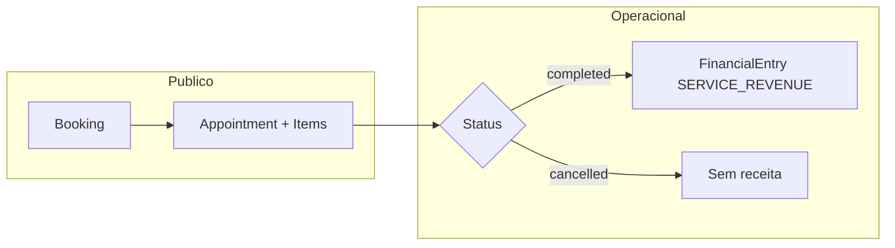
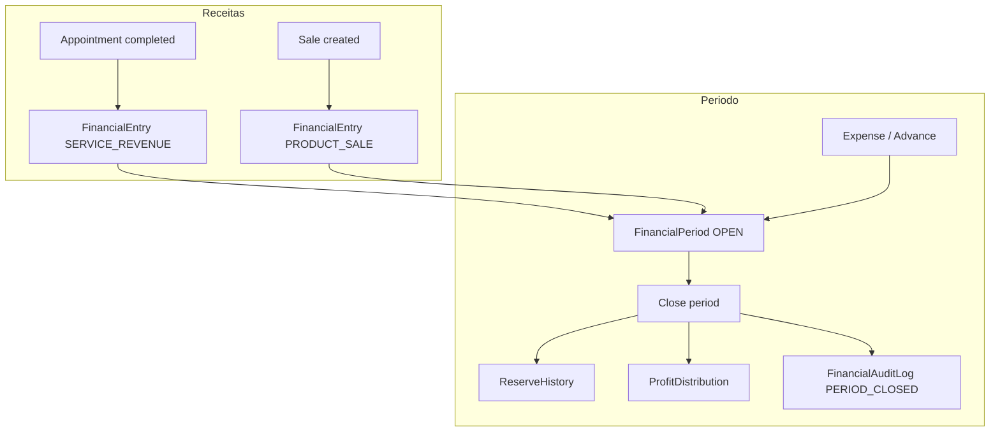
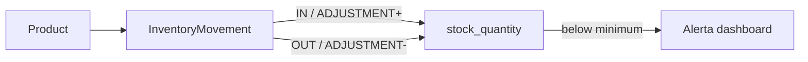
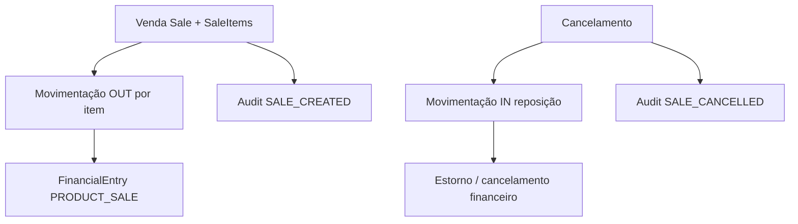

# Plataforma SaaS para Barbearia

**Plataforma operacional para barbearias, preparada para IA**, com agendamento público, painel interno, motor de agenda dinâmico, financeiro, estoque e vendas — refatoração moderna de um sistema legado em Django.

[](https://fastapi.tiangolo.com/)
[](https://nextjs.org/)
[](https://www.postgresql.org/)
[](https://www.typescriptlang.org/)
[](https://www.docker.com/)
[](LICENSE)

> **English:** see [README.md](./README.md)

---

## Visão geral

Este projeto **não é** um CRUD genérico de barbearia. É uma **base SaaS operacional** pensada para:

- **Agendamento público** sem cadastro de cliente
- **Operação interna** com papéis `admin` e `barber`
- **Agenda por intervalos de tempo** (não slots fixos engessados)
- **Atendimentos com vários serviços** (modelo de sessão)
- **Gestão financeira** com períodos, reserva de caixa e participação por profissional
- **Estoque e vendas** integrados ao fluxo financeiro
- **Camada de IA futura** (WhatsApp, automação) sem acoplar regra de negócio à interface

| Camada | Situação |
|--------|----------|
| API + PostgreSQL + migrations (001–014) | ✅ Implementado |
| Auth JWT + RBAC | ✅ Implementado |
| Booking público + “Meus agendamentos” | ✅ Implementado |
| Scheduling (`AppointmentItem`, disponibilidade, bloqueios) | ✅ Implementado |
| Conclusão de atendimento → receita automática | ✅ Implementado |
| Módulo financeiro (períodos, despesas, vales, fechamento) | ✅ Implementado |
| Estoque, vendas e categorias de produto | ✅ Implementado |
| Agentes de IA / WhatsApp | 📋 Planejado |

**Versão da API:** `0.2.0` · **Desenvolvimento ativo**

---

## Prévia do produto

As capturas de tela serão adicionadas antes da publicação no GitHub. Abaixo, os fluxos principais já existentes no código.

| Tela | Rota | Descrição |
|------|------|-----------|
| **Home pública** | `/` | Landing, serviços, profissionais, CTA WhatsApp |
| **Agendamento** | `/booking` | Serviço(s) → profissional → data → horário → confirmação |
| **Meus agendamentos** | `/my-appointments` | Consulta por telefone, cancelar / reagendar |
| **Dashboard** | `/dashboard` | Visão operacional (agenda do dia, estoque baixo, KPIs) |
| **Agendamentos** | `/dashboard/appointments` | Gestão de atendimentos e status |
| **Agenda** | `/dashboard/calendar` | Calendário de atendimentos |
| **Financeiro / Carteira** | `/dashboard/financial` | Admin: painel financeiro · Barber: carteira individual |
| **Estoque** | `/dashboard/inventory` | Produtos, movimentações, vendas, categorias |
| **Serviços** | `/dashboard/services` | CRUD de serviços (admin) |
| **Profissionais** | `/dashboard/professionals` | CRUD, participação %, disponibilidade (admin) |
| **Configurações → Perfil** | `/dashboard/settings/profile` | Perfil público do profissional |

```text
┌──────────────────────────────────────────────────────────────────────────┐
│  [ Home ]     [ Agendar ]     [ Meus agendamentos ]                       │
└──────────────────────────────────────────────────────────────────────────┘
                                    │
                                    ▼
┌──────────────────────────────────────────────────────────────────────────┐
│  FastAPI (/api/v1)  ◄──►  PostgreSQL  │  Redis (infra pronta)          │
└──────────────────────────────────────────────────────────────────────────┘
                                    │
          ┌─────────────────────────┼─────────────────────────┐
          ▼                         ▼                         ▼
    Agendamentos              Financeiro                 Estoque / Vendas
    (sessão + itens)     (períodos, auditoria)      (produtos, categorias)
```

---

## Funcionalidades

### Experiência pública

| Funcionalidade | Situação |
|----------------|----------|
| Landing page | ✅ |
| Catálogo de serviços | ✅ |
| Vitrine de profissionais (controle de visibilidade) | ✅ |
| Fluxo de agendamento em etapas | ✅ |
| Múltiplos serviços por agendamento (`service_ids`) | ✅ |
| Horários disponíveis (duração dinâmica, granularidade 15 min) | ✅ |
| “Meus agendamentos” por telefone | ✅ |
| Link para WhatsApp | ✅ (manual; automação WAHA planejada) |

### Painel operacional

| Funcionalidade | Situação |
|----------------|----------|
| Login JWT (access + refresh) | ✅ |
| Seed de admin na primeira subida | ✅ |
| Menu por papel (`admin` / `barber`) | ✅ |
| CRUD de serviços | ✅ |
| Onboarding de profissionais (nome, login, ativo) | ✅ |
| Participação percentual por profissional + validação 100% | ✅ |
| Perfil do profissional (foto, bio, especialidades, serviços, visibilidade) | ✅ |
| Vínculo Professional ↔ User (admin pode operar como barber) | ✅ |
| Gestão de agendamentos (status, conclusão, cancelamento, reagendamento) | ✅ |
| Conclusão de atendimento → `FinancialEntry(SERVICE_REVENUE)` | ✅ |
| Visão de calendário / agenda operacional | ✅ |
| `ProfessionalAvailability` + editor de disponibilidade | ✅ |
| `ProfessionalScheduleBlock` (bloqueios pontuais na agenda) | ✅ |
| Módulo financeiro (dashboard, despesas, vales, fechamento) | ✅ |
| Carteira do profissional (`/financial/my-wallet`) | ✅ |
| Estoque, movimentações, vendas, categorias | ✅ |

### Financeiro

| Funcionalidade | Situação |
|----------------|----------|
| Período financeiro aberto/fechado (`FinancialPeriod`) | ✅ |
| Lançamentos (`FinancialEntry`) com `amount_snapshot` | ✅ |
| Receita automática de serviços ao concluir agendamento | ✅ |
| Receita automática de vendas (`PRODUCT_SALE`) | ✅ |
| Despesas operacionais (`Expense`) | ✅ |
| Vales / adiantamentos (`Advance`) | ✅ |
| Reserva de caixa configurável (`FinancialSettings`) | ✅ |
| Histórico da reserva (`ReserveHistory`) | ✅ |
| Distribuição de lucro por participação (`ProfitDistribution`) | ✅ |
| Fechamento de período com snapshot de totais | ✅ |
| Auditoria (`FinancialAuditLog`) | ✅ |

### Estoque e vendas

| Funcionalidade | Situação |
|----------------|----------|
| CRUD de produtos com estoque mínimo | ✅ |
| Movimentações `IN` / `OUT` / `ADJUSTMENT` | ✅ |
| Bloqueio de estoque negativo | ✅ |
| Histórico de movimentações | ✅ |
| Venda operacional com baixa automática de estoque | ✅ |
| Cancelamento de venda com reposição e estorno financeiro | ✅ |
| Categorias de produto (CRUD, soft delete, filtro) | ✅ |
| Bloqueio de exclusão com produtos vinculados | ✅ |
| Agregações por categoria (preparação analytics) | ✅ |

### Arquitetura preparada para IA

A estrutura permite que agentes e automações consumam a **mesma API REST** e as mesmas regras de agenda.

| Capacidade | Situação |
|------------|----------|
| API stateless para agentes | ✅ |
| Camadas de domínio desacopladas | ✅ |
| Endpoints públicos com escopo por telefone | ✅ |
| Agente operacional LangGraph | 📋 Planejado |
| Integração WAHA (WhatsApp) | 📋 Planejado |
| Lembretes e reagendamento automático | 📋 Planejado |

---

## Stack tecnológica

### Backend

- **FastAPI** — API REST assíncrona, OpenAPI
- **SQLAlchemy 2** — ORM async (`postgresql.ENUM` com `values_callable` para enums de domínio)
- **PostgreSQL 16**
- **Redis 7** — conexão na subida (pronto para cache/filas)
- **Alembic** — migrations **001–014**

### Frontend

- **Next.js** (App Router)
- **React** + **TypeScript**
- **TanStack React Query**
- **Tailwind CSS** + **shadcn/ui**
- **React Hook Form** + **Zod**

### Infraestrutura

- **Docker** + **Docker Compose** — `postgres`, `redis`, `api`, `web`

### Camada de IA (futura)

- **LangGraph** — fluxos do agente operacional
- **OpenAI** — provedor LLM
- **WAHA** — gateway HTTP para WhatsApp

---

## Arquitetura

### Dois fluxos, um domínio

```text
                 FLUXO PÚBLICO                      FLUXO OPERACIONAL
                       │                                    │
   Cliente ──► Home / Booking / Meus agendamentos    Staff ──► Dashboard (JWT)
                       │                                    │
                       └──────────────┬─────────────────────┘
                                      ▼
                           FastAPI (/api/v1)
                                      │
        ┌─────────────────────────────┼─────────────────────────────┐
        ▼                             ▼                             ▼
   Agendamentos                  Financeiro                    Estoque / Vendas
   Serviços · Profissionais      Períodos · Auditoria          Produtos · Categorias
        │                             │                             │
        └─────────────────────────────┴─────────────────────────────┘
                                      ▼
                                PostgreSQL
```

### RBAC

| Entidade | Papel |
|----------|--------|
| **User** (`admin` / `barber`) | Autenticação — login, senha, papel |
| **Professional** | Perfil público, serviços, disponibilidade, agenda, participação % |
| **Cliente (guest)** | Agendamento e consulta por telefone — sem User |

- **Admin:** controle total (serviços, profissionais, financeiro, estoque, fechamento de período).
- **Barber:** própria agenda, perfil e carteira financeira; sem CRUD global de serviços/profissionais.

### Domínios do sistema

| Domínio | Responsabilidade | Principais entidades |
|---------|------------------|-------------------|
| **Identidade** | Auth JWT, papéis | `User` |
| **Catálogo** | Serviços ofertados | `Service`, `professional_services` (N:N) |
| **Profissionais** | Perfil, disponibilidade, participação | `Professional`, `ProfessionalAvailability`, `ProfessionalScheduleBlock` |
| **Agendamentos** | Sessões de atendimento e slots | `Appointment`, `AppointmentItem` |
| **Financeiro** | Períodos, receitas, despesas, reserva, distribuição | `FinancialPeriod`, `FinancialEntry`, `Expense`, `Advance`, `ProfitDistribution`, `FinancialSettings`, `ReserveHistory` |
| **Estoque** | Produtos e movimentações | `Product`, `ProductCategory`, `InventoryMovement` |
| **Vendas** | Venda de produtos com impacto em estoque e caixa | `Sale`, `SaleItem` |
| **Auditoria** | Trilha de eventos sensíveis | `FinancialAuditLog` |

### Modelos principais

#### Agendamentos

| Modelo | Campos / conceitos relevantes |
|--------|----------------------------|
| **Appointment** | Sessão: cliente, `professional_id`, data/hora, `total_duration_minutes`, `total_price`, `status` |
| **AppointmentItem** | Serviço na sessão: `service_id`, duração, preço, ordem |
| **ProfessionalAvailability** | Regra semanal: `weekday`, início/fim, ativo |
| **ProfessionalScheduleBlock** | Bloqueio pontual de intervalo na agenda |

Status de agendamento: `scheduled`, `confirmed`, `completed`, `cancelled`, `no_show`.

#### Financeiro

| Modelo | Campos / conceitos relevantes |
|--------|----------------------------|
| **FinancialPeriod** | `OPEN` / `CLOSED`, totais snapshot no fechamento |
| **FinancialEntry** | `SERVICE_REVENUE`, `PRODUCT_SALE`, `MANUAL_REVENUE`; `amount` + `amount_snapshot`; vínculos `appointment_id`, `sale_id`, `professional_id` |
| **Expense** | Despesa categorizada no período aberto |
| **Advance** | Vale / adiantamento ao profissional |
| **ProfitDistribution** | Distribuição calculada no fechamento por `participation_percentage` |
| **FinancialSettings** | `reserve_percentage` (reserva de caixa) |
| **ReserveHistory** | Movimentações da reserva acumulada |
| **FinancialAuditLog** | `action`, `entity_type`, `entity_id`, `metadata` (JSONB) |

#### Estoque e vendas

| Modelo | Campos / conceitos relevantes |
|--------|----------------------------|
| **ProductCategory** | Nome, cor, `is_active` (soft delete) |
| **Product** | `category_id`, preço, `stock_quantity`, `minimum_stock` |
| **InventoryMovement** | `IN`, `OUT`, `ADJUSTMENT` + quantidade e saldo |
| **Sale** / **SaleItem** | Venda com itens; status `COMPLETED` / `CANCELLED` |

#### Profissional (extensão financeira)

| Campo | Uso |
|-------|-----|
| `participation_percentage` | % do resultado distribuível no fechamento |
| `active_for_distribution` | Incluído no cálculo de distribuição |

### Motor de agenda (conceito central)

> **Agendamento ≠ um único serviço.**  
> **Agendamento = sessão de atendimento.** Os serviços ficam em **itens da sessão**.

**Algoritmo de slots:**

1. Soma da duração dos serviços escolhidos (`service_ids`).
2. Profissionais compatíveis (relação N:N com serviços).
3. Janelas de `ProfessionalAvailability` no dia da semana.
4. Exclusão de `ProfessionalScheduleBlock` e agendamentos com sobreposição real.
5. Passo de busca: **15 minutos**.

Preparado para: folgas, férias, exceções, combos e encaixes sugeridos por IA.

### Fluxos operacionais



1. **Criação** — público ou staff; validação de slot e serviços.
2. **Operação** — confirmação, reagendamento, bloqueios de agenda.
3. **Conclusão** — transição para `completed` dispara `FinancialService.record_service_revenue` (período aberto, snapshot de valor).
4. **Fechamento** — admin encerra período: calcula reserva, despesas, distribuição por participação, persiste snapshots.

### Fluxo financeiro



- **Participação:** soma das `participation_percentage` dos profissionais ativos para distribuição deve ser **100%** (validado no fechamento).
- **Reserva:** percentual configurável retido do resultado antes da distribuição.
- **Carteira do barber:** visão de receitas, vales e participação no período atual / histórico.

### Fluxo de estoque



- Toda alteração de quantidade gera `InventoryMovement` e auditoria `STOCK_UPDATED`.
- Estoque negativo é **bloqueado** na camada de serviço.

### Fluxo de vendas



### Auditoria financeira

Eventos registrados em `financial_audit_logs` (enum PostgreSQL `financial_audit_action`):

| Ação | Origem típica |
|------|----------------|
| `EXPENSE_CREATED` | Nova despesa |
| `ADVANCE_CREATED` | Novo vale |
| `SETTINGS_UPDATED` | Alteração de configurações |
| `RESERVE_UPDATED` | Movimento de reserva |
| `PERIOD_CLOSED` | Fechamento de período |
| `PRODUCT_CREATED` / `PRODUCT_UPDATED` | CRUD de produto |
| `STOCK_UPDATED` | Movimentação de estoque |
| `SALE_CREATED` / `SALE_CANCELLED` | Venda / cancelamento |
| `CATEGORY_CREATED` / `CATEGORY_UPDATED` / `CATEGORY_DEACTIVATED` | Categorias de produto |

Entidades auditadas (`financial_entity_type`): `EXPENSE`, `ADVANCE`, `FINANCIAL_SETTINGS`, `FINANCIAL_PERIOD`, `RESERVE_HISTORY`, `PRODUCT`, `SALE`, `INVENTORY_MOVEMENT`, `PRODUCT_CATEGORY`.

### Estrutura atual do banco

Migrations Alembic (head **014**):

| Rev | Tema |
|-----|------|
| 001–007 | Users, services, professionals, appointments, booking refactor |
| 008 | `professional_schedule_blocks` |
| 009–011 | Módulo financeiro (períodos, entries, despesas, vales, distribuição, auditoria, participação) |
| 012 | Produtos, movimentações, vendas, enums de auditoria inventory |
| 013 | `product_categories`, `products.category_id` |
| 014 | Consolidação de valores de enum de auditoria |

**Tabelas principais (por domínio):**

```text
users
services · professionals · professional_services · professional_availabilities · professional_schedule_blocks
appointments · appointment_items
financial_settings · financial_periods · financial_entries · expenses · advances
profit_distributions · reserve_history · financial_audit_logs
product_categories · products · inventory_movements · sales · sale_items
```

### Camadas no backend

```text
api/v1  →  services  →  repositories  →  models
              ↑
         schemas (Pydantic)
```

Rotas registradas em `app/api/router.py`: `health`, `auth`, `users`, `appointments`, `public/appointments`, `services`, `professionals`, `financial`, `inventory` (inclui `/categories`).

---

## Estrutura de pastas

```text
barber_refac/
├── backend/
│   ├── app/
│   │   ├── api/v1/          # REST (auth, appointments, financial, inventory, …)
│   │   ├── core/            # config, deps, RBAC, exceptions
│   │   ├── models/          # SQLAlchemy (appointment, financial, inventory, …)
│   │   ├── repositories/
│   │   ├── schemas/
│   │   └── services/        # appointment_service, financial_service, sales_service, …
│   └── alembic/versions/    # 001 … 014
├── frontend/
│   └── src/features/
│       ├── appointments/ · availability/ · agenda/
│       ├── financial/     # dashboard, despesas, vales, carteira
│       ├── inventory/     # produtos, vendas, categorias
│       ├── professionals/ · services/ · dashboard/
│       └── public-appointments/
├── docs/
├── docker-compose.yml
├── .env.example
├── README.md
└── README.pt-BR.md
```

---

## Como rodar localmente

### Requisitos

- Docker e Docker Compose **ou**
- Python 3.12+, Node 20+, PostgreSQL 16, Redis 7

### Início rápido (Docker — recomendado)

```bash
cd barber_refac
cp .env.example .env
# Ajuste JWT e senha do admin antes de ambientes compartilhados

docker compose up --build
```

| Serviço | URL |
|---------|-----|
| Frontend (dev) | http://localhost:3001 (`WEB_PORT` padrão) |
| API | http://localhost:8000 |
| Swagger | http://localhost:8000/docs |
| PostgreSQL | `localhost:5432` |
| Redis | `localhost:6379` |

Migration atual no Alembic: **014** (aplicada na subida do container `api`). Admin inicial: `ADMIN_EMAIL` e `ADMIN_PASSWORD`.

> **Frontend:** chamadas à API usam prefixo `/api/v1/...` (ex.: `/api/v1/financial`, `/api/v1/inventory`).

### Só backend

```bash
cd backend
python -m venv .venv
.venv\Scripts\activate    # Linux/macOS: source .venv/bin/activate
pip install -r requirements.txt
alembic upgrade head
uvicorn app.main:app --reload --port 8000
```

### Só frontend

```bash
cd frontend
npm install
npm run dev
```

Use `.env` na raiz para Compose ou `.env.local` no frontend com `NEXT_PUBLIC_API_URL=http://localhost:8000`.

### Variáveis essenciais

| Variável | Uso |
|----------|-----|
| `DATABASE_URL` | Conexão PostgreSQL async |
| `REDIS_URL` | Redis |
| `JWT_SECRET_KEY` / `JWT_REFRESH_SECRET_KEY` | Tokens |
| `CORS_ORIGINS` | Origens do frontend |
| `NEXT_PUBLIC_API_URL` | Base da API no Next.js |
| `ADMIN_EMAIL` / `ADMIN_PASSWORD` | Seed do administrador |

---

## Status do desenvolvimento

Repositório em **evolução contínua**. Hoje está sólido:

- Arquitetura **FastAPI + Next.js** desacoplada
- **PostgreSQL** com migrations versionadas (001–014)
- **Booking público** e autoatendimento por telefone
- Modelo de **sessão** com `AppointmentItem` e scheduling completo
- **Financeiro** com períodos, reserva, distribuição e auditoria
- **Estoque, vendas e categorias** integrados ao financeiro
- **RBAC** e regras de vínculo User ↔ Professional

Ainda em construção / planejado:

- Relatórios operacionais e analytics
- Refino de UX (mobile-first, calendário)
- **Nenhum agente de IA em produção** — apenas estrutura preparada

---

## Roadmap

### Entregue

- [x] Agenda (scheduling, calendário, disponibilidade, bloqueios)
- [x] Financeiro (períodos, receitas, despesas, vales, reserva, fechamento, carteira)
- [x] Estoque (produtos, movimentações, estoque mínimo)
- [x] Vendas (baixa de estoque, integração financeira, cancelamento)
- [x] Categorias de produto

### Próximos passos

- [ ] Relatórios operacionais
- [ ] Analytics (dashboards, agregações por categoria/período)
- [ ] IA operacional (LangGraph + WAHA)
- [ ] Refino de UX (dashboard, calendário, mobile-first)
- [ ] QA ampliado dos fluxos críticos
- [ ] Deploy em produção documentado · CI/CD

### Melhorias futuras

- [ ] White-label por unidade
- [ ] Temas customizáveis
- [ ] Sistema de notificações (e-mail / push / WhatsApp)

---

## Visão de IA

Objetivo: um **agente operacional no WhatsApp** que respeite as mesmas regras da aplicação web:

- Consultar disponibilidade real (regras semanais + bloqueios + agenda ocupada)
- Criar sessões com vários `AppointmentItem`
- Consultar status de agendamento por telefone
- Enviar lembretes e tratar cancelamento/reagendamento com validação por telefone
- Encaminhar para humano quando necessário

Não há runtime LangGraph neste repositório ainda. A API foi desenhada para que a automação seja plugada depois, sem reescrever o domínio.

---

## API (resumo)

Prefixo global: `/api` · versão: `/v1`

| Área | Prefixo | Notas |
|------|---------|-------|
| Health | `/api/v1/health` | Liveness |
| Auth | `/api/v1/auth` | Login, refresh |
| Users | `/api/v1/users` | Perfil do usuário logado |
| Serviços | `/api/v1/services` | Catálogo |
| Profissionais | `/api/v1/professionals` | CRUD, perfil, disponibilidade, slots, bloqueios |
| Agendamentos (staff) | `/api/v1/appointments` | JWT; conclusão gera receita |
| Agendamentos públicos | `/api/v1/public/appointments` | Guest por telefone |
| Financeiro | `/api/v1/financial` | Dashboard, despesas, vales, fechamento, carteira |
| Estoque | `/api/v1/inventory` | Produtos, movimentações, vendas, dashboard |
| Categorias | `/api/v1/inventory/categories` | CRUD + agregações |

Documentação interativa: **http://localhost:8000/docs**

---

## Contribuindo

Projeto de portfólio / produto em refatoração. Após publicação no GitHub:

1. Faça fork
2. Branch (`git checkout -b feature/minha-mudanca`)
3. Commits claros
4. Abra um Pull Request

---

## Licença

MIT — [LICENSE](LICENSE).

---

<p align="center">
  <sub>Refatoração SaaS profissional · PostgreSQL-first · Preparado para IA operacional</sub>
</p>
